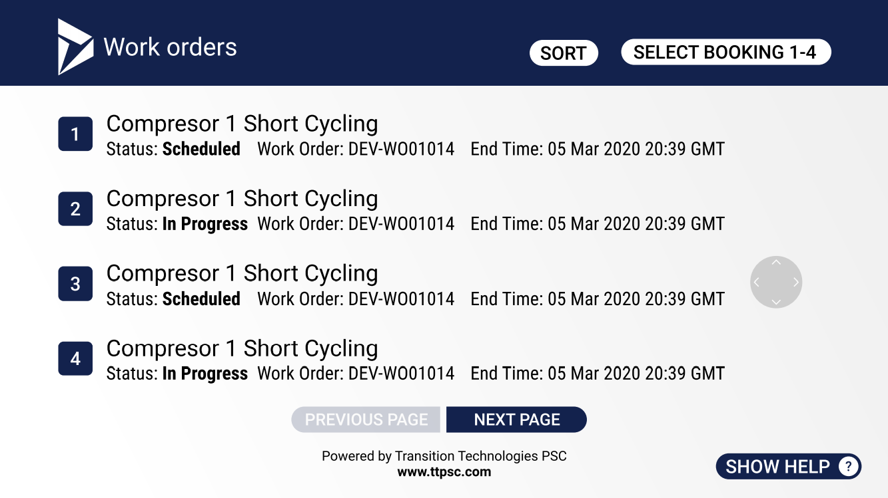

# Dynamics Work Order Management application

DynamicsWOM is a sample Java/Kotlin application written for [RealWear HMT devices](https://www.realwear.com/products/hmt-1/) that allows managing Dynamics Work Orders hands-free.

## HMT-1 Product overview

The RealWear HMT-1 is hands-free Android &trade tablet class wearable computer for industrial workers.
Device can be used in wet, dusty, hot or loud industrial environments. It is powered with High resolution display that views like 7 inch tablet.

## Application screens

When application is started for the first time or when authorization token has expired login screen is shown.

The structure of QR code we use to log in contains Base64 encoded json with fields like below.
    {
        "UserId":"max@contoso.com",
        "ResourceId":"https://contoso.crm.dynamics.com"
    }

It is suggested to use [RealWear Companion app](https://play.google.com/store/apps/details?id=com.realwear.companionapp&hl=en) to input passwords by QR code generation.
Logged in user can see the home screen.

Say 'Go to work orders' voice command to see work orders list assigned on the logged in user.

Use 'Select Booking #' Command to open required Work Order details page.
On the Details page user can navigate through diferent tabs: "Summary", "Details", "Attachments", "Notes".
On any tab of the booking details page user can 'Change Status' of the Work Order to 'In Progress', 'Completed' or other available.

On the "Attachments" tab user is able to view media content attached to the Work Order. It can be pdf document, image or video.

On the "Notes" tab user is able to add comments that will be published to Dynamics 365.

Application supports deep linking for smoothe integration with other application built for HMT devices.

## Contributing

This project welcomes contributions and suggestions.  Most contributions require you to agree to a
Contributor License Agreement (CLA) declaring that you have the right to, and actually do, grant us
the rights to use your contribution. For details, visit https://cla.opensource.microsoft.com.

When you submit a pull request, a CLA bot will automatically determine whether you need to provide
a CLA and decorate the PR appropriately (e.g., status check, comment). Simply follow the instructions
provided by the bot. You will only need to do this once across all repos using our CLA.

This project has adopted the [Microsoft Open Source Code of Conduct](https://opensource.microsoft.com/codeofconduct/).
For more information see the [Code of Conduct FAQ](https://opensource.microsoft.com/codeofconduct/faq/) or
contact [opencode@microsoft.com](mailto:opencode@microsoft.com) with any additional questions or comments.
